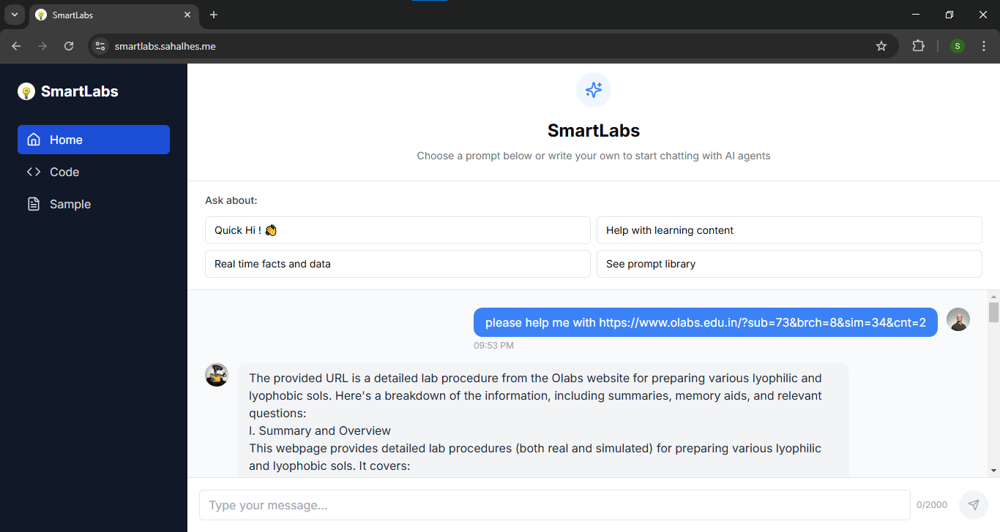
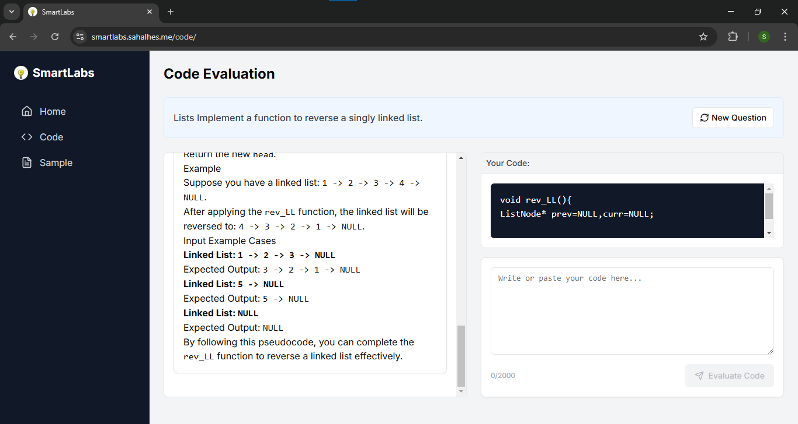
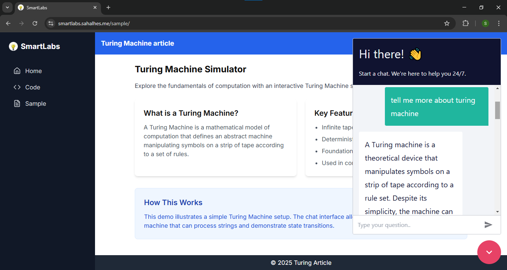

# SmartLabs


https://github.com/user-attachments/assets/225379e4-9fa5-46f8-b924-e8e5de3216f6


Prototype - https://smartlabs.sahalhes.me
(built during olabs hackathon)  
- Welcome to the SmartLabs project! This README will guide you through setting up the environment variables, local setup, and provide an overview of the tech stack used.

## Demo




## Technologies used while building

- **Next.js**: A React framework for server-side rendering and generating static websites.
- **n8n**: A workflow automation tool in backend.
- **gpt 4o mini**:For classifying the agentic task
- **Neon postgres database**: To store chat history with ai
- **Postman**: Testing API calls
- **ShadCN**: A design system for building consistent and beautiful user interfaces.
- **Lucide**: An open-source icon library.

## Setting Up Environment Variables

To set up the environment variables, follow these steps:

1. Create a `.env.local` file in the root directory of the project.
2. Add the necessary environment variables to the `.env.local` file.
3. Refer .env.example for better understanding

3. Save the `.env.local` file.

## Local Setup

To set up the project locally, follow these steps:

1. Clone the repository:

    ```sh
    git clone https://github.com/sahalhes/smartlabs.git
    cd smartlabs
    ```

2. Install the dependencies:

    ```sh
    npm install
    ```

3. Set up the environment variables as described above.

4. Start the development server:

    ```sh
    npm run dev
    ```

5. Open your browser and navigate to `http://localhost:3000` to see the application running.

## Contributing

We welcome contributions! Please read our [contributing guidelines](CONTRIBUTING.md) for more information.

## License

This project is licensed under the MIT License. See the [LICENSE](LICENSE) file for details.
